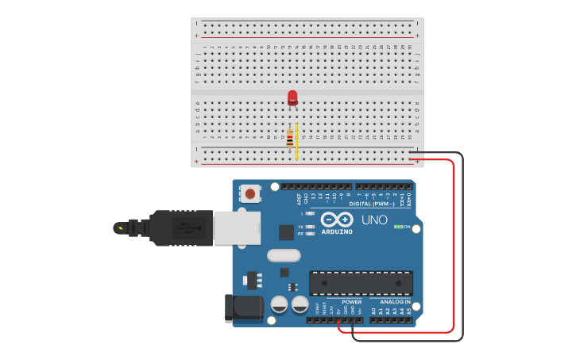

# Vídeo 1 - Prazer, Arduino

## Descrição

Neste vídeo, explico o básico necessário para se utilizar leds e apresento a estrutura básica de um programa para Arduino usando a IDE.

Falo, ainda, sobre as primeiras funções para se manipular a porta, além de uma introdução bem superficial do que se trata a eletrônica digital e como um microcontrolador é capaz de realizar instruções em grandes velocidades.

O programa é a reconstrução do clássico Blink, disponível nos exemplos presentes na instalação básica da Arduino IDE.

São apresentadas as funções internas `pinMode()`, `digitalWrite()` e `delay()`.

## Montagem

Neste vídeo introdutório, Os circuitos são bem simples, pois os experimentos se resumem a leds ligados diretamente na protoboard e o uso do led incorporado do Arduino Uno.

## Recursos

### Vídeo

* [Youtube](https://youtu.be/l0JxLxfGLc8)

### Circuitos e diagramas

* [Circuito no Thinkercad](https://www.tinkercad.com/things/ioFDkrXA9KT)

### Datasheets

* [Led vermelho genérico](../datasheets/led.pdf)

### Documentação oficial

* [`pinMode()`](https://www.arduino.cc/reference/pt/language/functions/digital-io/pinmode/)
* [`digitalWrite()`](https://www.arduino.cc/reference/pt/language/functions/digital-io/digitalwrite/)
* [`delay()`](https://www.arduino.cc/reference/pt/language/functions/time/delay/)

## Licença

O conteúdo deste curso é licenciado sob [Atribuição 3.0 Brasil (CC BY 3.0 BR)](https://creativecommons.org/licenses/by/3.0/br)