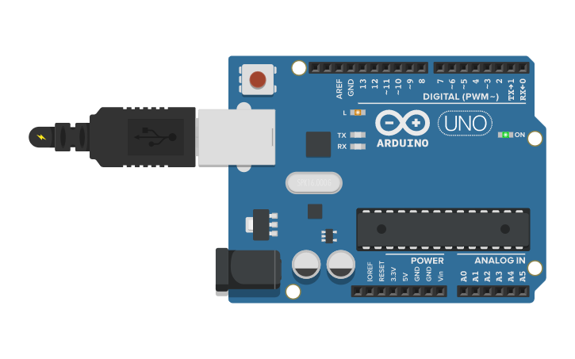

# Vídeo 1

## Descrição

Neste vídeo, explico o básico necessário para se utilizar leds e apresento a estrutura básica de um programa para Arduino usando a IDE.

Falo, ainda, sobre as primeiras funções para se manipular a porta, além de uma introdução bem supercifial do que se trata a eletrônica digital e como um microcontrolador é capaz de realizar instruções em grandes velocidades.

O programa é a reconstrução do clássico Blink, disponível nos exemplos presentes na instalação básica da Arduino IDE.

São apresentadas as funções internas `pinMode()`, `digitalWrite()` e `delay()`.

## Montagem

Para este primeiro vídeo, não há circuito, pois os experimentos se resumem a leds diretamente na protoboard e o uso do led incorporado do Arduino Uno.

