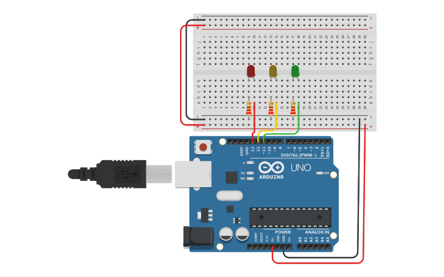

# Vídeo 2 - Portas de saída, `if`, `#define` e variáveis

## Descrição

  Neste vídeo, começo a utilizar o Arduino para controlar leds externos, apresentando como usar várias portas ao mesmo tempo.

  Aproveito para introduzir o conceito de função e como declarar a primeira função e passar parâmetro para ela.

  São abordados os primeiros conceitos de estruturas condicionais `if`, explicando o que é uma comparação e o que a diferencia de atribuição.

  Além disso, apresento o conceito de diretiva, a diretiva #define e sua diferença entre #define e variável.

## Montagem

A montagem é bastante simples, contando apenas com um arduino, três leds e três resistores.

## Recursos

### Vídeo

* [Youtube](https://youtu.be/CUbEBmEMMaM)

### Circuitos e diagramas

* [Circuito no Thinkercad](https://www.tinkercad.com/things/djQAkdwqXOO)

### Datasheets

* [Led vermelho genérico](../datasheets/led.pdf)

### Documentação oficial

* [`if`](https://www.arduino.cc/reference/pt/language/structure/control-structure/if/)
* [Operador de atribuição `=`](https://www.arduino.cc/reference/pt/language/structure/arithmetic-operators/assignment/)
* [Operador de comparação `==`](https://www.arduino.cc/reference/pt/language/structure/comparison-operators/equalto/)
* [Diretiva `#define`](https://www.arduino.cc/reference/pt/language/structure/further-syntax/define/)
* [Tipo de dados `int`](https://www.arduino.cc/reference/pt/language/variables/data-types/int/)

## Licença

O conteúdo deste curso é licenciado sob [Atribuição 3.0 Brasil (CC BY 3.0 BR)](https://creativecommons.org/licenses/by/3.0/br)