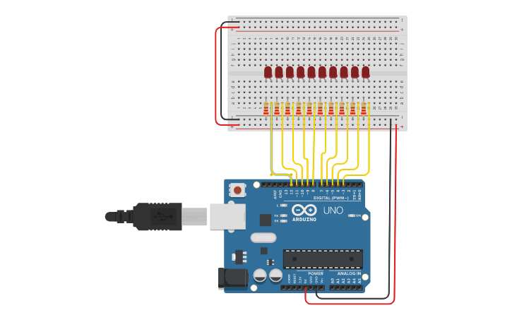

# Vídeo 3 - O `for` em um array de leds

## Descrição

  Neste vídeo, uso o componente "matriz de leds" para introduzir o conceito de laços, explicando a estrutura de um "for" simples e o que é iteração.

  Apresento o primeiro conceito formal de variável e como declarar, tanto no corpo do programa como na estrutura do "for". Apresento ainda a manipulação e a maneira simplificada de incrementar variável no C.

  Mostro, em seguida, um exemplo de erro de lógica, o conceito de "escopo" e a diferença entre variáveis locais e globais.

## Montagem

A montagem requer um Arduino, um array de leds (que pode ser substituída por dez leds comuns) e dez resistores.

## Recursos

### Vídeo

* [Youtube](https://youtu.be/xnWyeCuxXg4)

### Circuitos e diagramas

* [Circuito no Thinkercad](https://www.tinkercad.com/things/alvZfQkhvFZ)

### Datasheets

* [Array de leds](../datasheets/led-matrix.pdf)

### Documentação oficial

* [`for`](https://www.arduino.cc/reference/pt/language/structure/control-structure/for/)
* [Operador de incremento `++`](https://www.arduino.cc/reference/pt/language/structure/compound-operators/increment/)

## Licença

O conteúdo deste curso é licenciado sob [Atribuição 3.0 Brasil (CC BY 3.0 BR)](https://creativecommons.org/licenses/by/3.0/br)