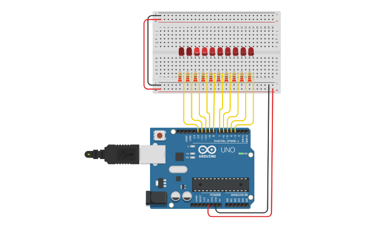

# Vídeo 4 - Aprimorando o uso do array de leds

## Descrição

Neste vídeo, continuo com o exemplo anterior, apresentando apenas um pequeno acréscimo na complexidade do programa. Declaro mais uma variável e incluo mais uma condição.

Apresento superficialmente o significado de cátodo comum, necessário para o vídeo seguinte.

## Montagem

A montagem é a mesma usada no vídeo anterior, pois trata-se apenas de um aprofundamento na lógica de programação.

## Recursos

### Vídeo

* [Youtube](https://www.youtube.com/channel/UCAib0cXITygk7oFaeo3beUQ)

### Circuitos e diagramas

* [Circuito no Thinkercad](https://www.tinkercad.com/things/fTUdaSjy5fA)

### Datasheets

* [Matriz de leds](../datasheets/led-matrix.pdf)

## Licença

O conteúdo deste curso é licenciado sob [Atribuição 3.0 Brasil (CC BY 3.0 BR)](https://creativecommons.org/licenses/by/3.0/br)