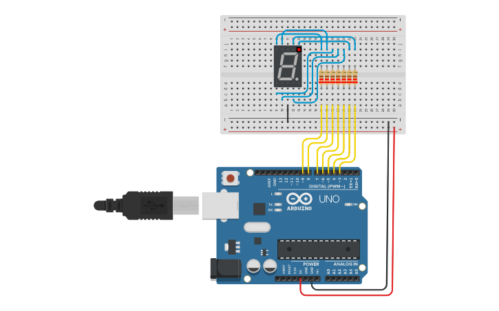

# Vídeo 7 - Bytes, vetores e arrays multidimensionais

## Descrição

Neste vídeo, ainda com a mesma montagem com o display de 7 segmentos, vamos aprimorar ainda mais o nosso código através do aprofundamento na linguagem C.

Apresento o tipo `byte` (um 'alias' para o tipo nativo `unsigned char`) e a sua vantagem sobre o tipo `int`, apresentado anteriormente.

Apresento, ainda, a definição de `vetor`, como declarar e acessar e suas vantagens.

Continuo mostrando maneiras diferentes de mapear os segmentos de cada um dos 10 dígitos, tornando o código cada vez mais eficiante.

## Montagem

A montagem utilizada é a mesma dos vídeos anteriores, ou seja, um Arduino, um display de 7 segmentos e 7 resistores.

## Recursos

### Vídeo

* [Youtube](https://youtu.be/e8KcvJOm4uM)

### Circuitos e diagramas

* [Circuito no Thinkercad](https://www.tinkercad.com/things/d4HlSnLgrtw)

### Datasheets

* [Display de 7 segmentos](../datasheets/7seg-display.pdf)

### Documentação oficial

* [`byte` (Tipo de dados)](https://www.arduino.cc/reference/pt/language/variables/data-types/byte/)
* [Vetor](https://www.arduino.cc/reference/pt/language/variables/data-types/array/)

## Licença

O conteúdo deste curso é licenciado sob [Atribuição 3.0 Brasil (CC BY 3.0 BR)](https://creativecommons.org/licenses/by/3.0/br)