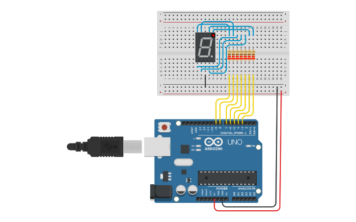

# Vídeo 9 - Manipulação de bits

## Descrição

Neste vídeo, o último com a montagem atual usando o display de 7 segmentos, vamos fazer a última otimização no código através de mais um aprofundamento na linguagem C e no framework do Arduino.

Para isso, uso o conteúdo teórico apresentado no vídeo 8 para mostrar que cada dígito do display de 7 segmentos pode ser inteiramente configurado usando apenas um byte, usando apenas um bit para representar cada um dos segmentos, acessando estes bits através da função `bitRead()`.

## Montagem

A montagem utilizada é a mesma dos vídeos anteriores, ou seja, um Arduino, um display de 7 segmentos e 7 resistores.

## Recursos

### Vídeo

* [Youtube](https://youtu.be/kTGHHFRkQaw)

### Circuitos e diagramas

* [Circuito no Thinkercad](https://www.tinkercad.com/things/9gXcOIuYgss)

### Datasheets

* [Display de 7 segmentos](../datasheets/7seg-display.pdf)

### Documentação oficial

* [`bitRead()`](https://www.arduino.cc/reference/pt/language/functions/bits-and-bytes/bitread/)

## Licença

O conteúdo deste curso é licenciado sob [Atribuição 3.0 Brasil (CC BY 3.0 BR)](https://creativecommons.org/licenses/by/3.0/br)