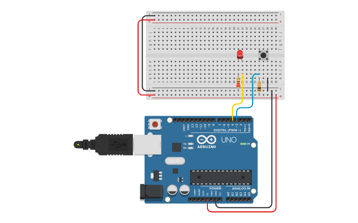

# Vídeo 10 - Input, Pull-up e digitalRead

## Descrição

Neste vídeo, apresento como usar as portas do Arduino no modo entrada através da função `digitalRead()`. Aproveito para mostrar o conceito básico de sensores, apresentando o switch, o mais simples dos sensores, e como ele funciona.

Mostro, ainda, o conceito de pull-up e a diferença entre os modos `INPUT` e `INPUT_PULLUP`.

Contamos agora com uma nova ferramenta: um analisador do estado de cada pino, que será apresentado com mais detalhes em vídeos posteriores.

## Montagem

A montagem utiliza um resistor, um switch simples e dois resistores, sendo um para o led e outro para apresentar o conceito de resistor pull-up. Este último será, depois, removido do circuito.

## Recursos

### Vídeo

* [Youtube](https://youtu.be/ztcxRdF0Y9I)

### Circuitos e diagramas

* [Circuito no Thinkercad](https://www.tinkercad.com/things/czBK44ExxN5)

### Documentação oficial

* [`digitalRead()`](https://www.arduino.cc/reference/pt/language/functions/digital-io/digitalread/)
* [`INPUT` e ÌNPUT_PULLUP`](https://www.arduino.cc/reference/pt/language/variables/constants/constants/)

## Licença

O conteúdo deste curso é licenciado sob [Atribuição 3.0 Brasil (CC BY 3.0 BR)](https://creativecommons.org/licenses/by/3.0/br)