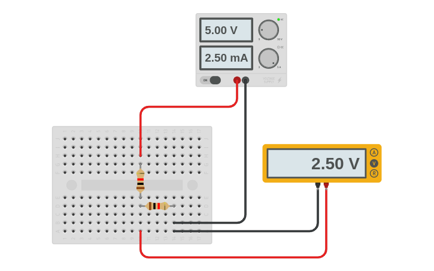

# Vídeo 11 - Divisor de tensão e potenciômetro

## Descrição

Neste vídeo, apresento superficialmente a teoria sobre o circuito divisor de tensão, aplicando, na prática, a Lei de Ohm.

Esta apresentação é necessária para se entender os assuntos abordados a partir do vídeo seguinte, que mostrará uma aplicação prática imediata da teoria abordada aqui.

Apresento, ainda, um novo componente: o potenciômetro, explicando detalhadamente o porquê de ele ser, além de um resistor variável, também um divisor de tensão.

## Montagem

O circuito do vídeo é bastante simples, não usando nem mesmo o Arduino, mas apenas dois resistores, uma fonte e um multímetro.

## Recursos

### Vídeo

* [Youtube](https://youtu.be/)

### Circuitos e diagramas

[Circuito no Thinkercad](https://www.tinkercad.com/things/1acd726ywdN)

### Datasheets

* [Potenciômetro genérico](../datasheets/potentiometer.pdf)

## Licença

O conteúdo deste curso é licenciado sob [Atribuição 3.0 Brasil (CC BY 3.0 BR)](https://creativecommons.org/licenses/by/3.0/br)
