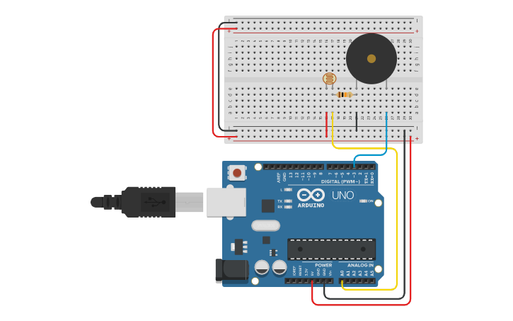

# Vídeo 12 - LDR, buzzer, potenciômetro, analogRead e um alarme simples

## Descrição

Neste vídeo, apresento como usar as portas analógicas do Arduino através da função `analogRead()`. Através da aplicação direta da teoria apresentada no vídeo anterior, demonstro como conseguimos obter vários valores diferentes na porta analógica A0 usando um potenciômetro comum.

A seguir, mostro um componente novo: o **LDR**. Analiso a sua variação de resistência de acordo com a incidência de luz e faço um divisor de tensão simples usando um outro resistor e a teoria que já aprendemos.

Por fim, mostro a construção de um alarme de interrupção de laser, usando o divisor de tensão em conjunto com dois novos componentes: o **emissor laser** e o **buzzer ativo**.

## Montagem

A montagem varia no decorrer da explicação, iniciando com a aplicação do potenciômetro e concluindo com a montagem de um alarme de interrupção totalmente funcional usando laser.

## Cuidados importantes

**Você não deve apontar nenhum emissor de laser para pessoas ou animais. Este equipamento pode causar danos irreparáveis à visão.**

## Recursos

### Vídeo

* [Youtube](https://youtu.be/iIR9_Lfua_w)

### Circuitos e diagramas

* [Circuito no Thinkercad](https://www.tinkercad.com/things/haCbqNjYgH4)

### Datasheets

* [Buzzer ativo](../datasheets/buzzer-active.pdf)
* [Emissor de laser](../datasheets/laser.pdf)
* [LDR](../datasheets/ldr.pdf)

### Documentação oficial

* [`analogRead()`](https://www.arduino.cc/reference/en/language/functions/analog-io/analogread/)

## Licença

O conteúdo deste curso é licenciado sob [Atribuição 3.0 Brasil (CC BY 3.0 BR)](https://creativecommons.org/licenses/by/3.0/br)