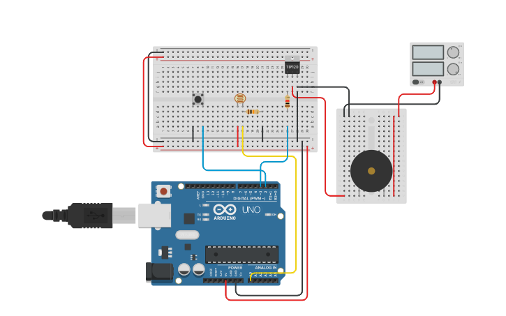

# Vídeo 14 - Introdução a transistores

## Descrição

Neste vídeo, eu apresento de forma bastante superficial o componente que possibilitou o mundo da forma que conhecemos hoje: o transistor.

Minha intenção é apresentar a teoria necessária para fazer um transistor NPN funcionar como uma chave eletrônica, mas eu aproveito para mostrar alguns poucos detalhes do seu datasheet e como selecionar um modelo para o nosso projeto

Fazemos também uma montagem prática, onde usaremos um sinal de 5V e uma corrente muito baixa (próxima a 4mA) para ativar um outro circuito que está funcionando a 12V e com uma corrente próxima a 200mA.

Para o teste prático, usamos uma sirene de 12V e 200mA, que será usada em vídeos futuros.

## Montagem

A montagem é uma demonstração de como usar um transistor NPN ligado em emissor comum para ser usado como chave eletônica. Usamos duas fontes de alimentação, sendo uma de 5V e outra de 12V.

## Recursos

### Vídeo

* [Youtube](https://youtu.be/)

### Circuitos e diagramas

* [Circuito no Thinkercad](https://www.tinkercad.com/things/)

### Datasheets

* [Transistor 2N3904](../datasheets/transistor-2n3904.pdf)
* [Transistor TIP31](../datasheets/transistor-tip31.pdf)

### Documentação oficial

* [`analogRead()`](https://www.arduino.cc/reference/en/language/functions/analog-io/analogread/)

## Licença

O conteúdo deste curso é licenciado sob [Atribuição 3.0 Brasil (CC BY 3.0 BR)](https://creativecommons.org/licenses/by/3.0/br)